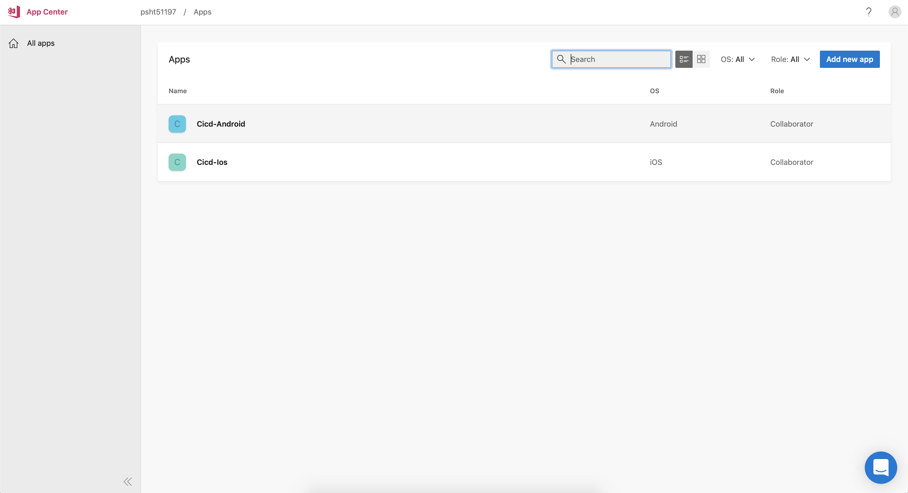
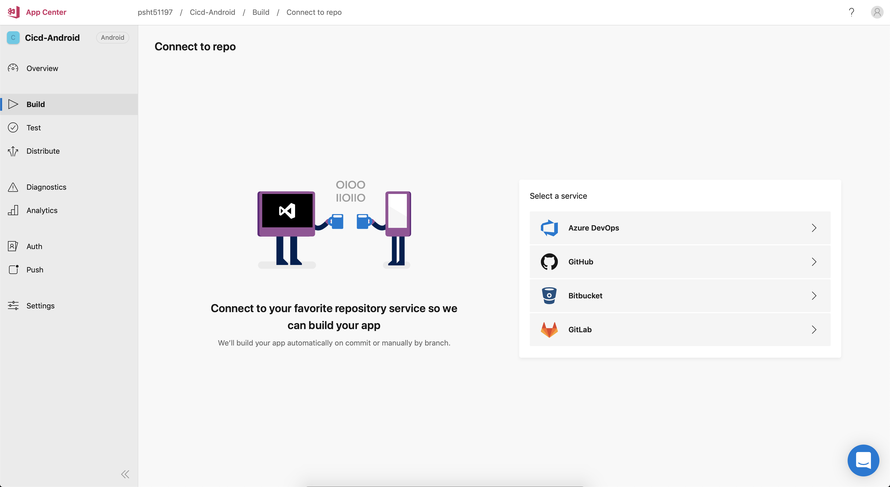

# CICD

## 1. Điều kiện :

- Phiên bản **React Native** đang dùng phải từ **0.34** trở lên
- Thiết bị sử dụng :
  - Android :
    - **Version 4.1**.
    - **API level từ 12** trở lên.
  - IOS :
    - **Version 9.0** trở lên.
- Không sử dụng thư viện hỗ trợ báo cáo sự cố ( **Crash Reporting** ) trên IOS.
- Trên IOS, Sử dụng [CocoaPods](https://cocoapods.org/). Tham khảo thêm tại [ CocoaPods Getting Started ](https://guides.cocoapods.org/using/getting-started.html)

## 2. Cài đặt:

- [App Center](./readme/Appcenter.md)
- [React Native](./readme/ReactNative.md)

## 3. Build ứng dụng với Appcenter:

- Sau khi tạo ứng dụng tại dashboard [App Center](./readme/Appcenter.md), ta có 2 app trên dashboard (1 cho ios và 1 cho android )
  

- Chọn vào dự án, di chuyển tới build để thực hiện link repo ở SVC(github, gitlab,...)

  

- Sau khi chọn xog SVC mà project sử dụng, tiếp tục chọn repo của project

  

- Tiếp tục chọn brand muốn build

  > **Lưu ý** : brand lựa chọn ở bước này là brand sẽ được build mỗi khi có code đc push lên hoặc đc merge code
  > 

- Sau khi chọn xong brand có thể trực tiếp config cách build ngay bằng cách click build config

  

- Giao diện config :

    

        

            IOS
        

  

  - Options :

    > Project: pakage.json - thông tin dự án (tên, version, dependency,...)
    >
    > Share Scheme: [**Scheme Build**](./readme/iosConfig/iosConfigScheme.md) (ios, tvos)
    >
    > Xcode version: chọn version xcode để build
    >
    > Nodejs version: chọn version nodejs để load các dependency
    >
    > Build Frequency: chọn cách build ( build mỗi khi branch đc push code lên hoặc build bằng tay)
    >
    > Use legacy build system: bỏ qua xcworkspace, build bằng xcodeproj
    >
    > Automatically increment build number: tự động gia tăng phiên bản build
    >
    > Run unit test: chạy test thông qua npm test trong khi build (jest, ....)
    >
    > Environment variables: custom biến môi trường
    >
    > Sign builds: cung cấp [**Certificate**](./readme/iosConfig/iosConfigCertificate.md) và [**Provisioning Profile**](./readme/iosConfig/iosConfigProvisioning.md) để có thể build ra .ipa file và test trên máy thật
    >
    > Distribute builds: lựa chọn cách build (có thể gữi tới những thành viên trong dự án thông qua VSC hoặc release lên App Store )

  - Sau khi cấu hình xong có thể bắt đầu build ngay
    

      

      

          

              Android
          

    

    - Options :

    > Project: pakage.json - thông tin dự án (tên, version, dependency,...)
    >
    > Build Variant: Chọn loại build (release hoặc debug)
    >
    > Nodejs version: chọn version nodejs để load các dependency
    >
    > Build Frequency: chọn cách build ( build mỗi khi branch đc push code lên hoặc build bằng tay)
    >
    > Automatically increment build number: tự động gia tăng phiên bản build
    >
    > Run unit test: chạy test thông qua npm test trong khi build (jest, ....)
    >
    > Environment variables: custom biến môi trường
    >
    > Sign builds: Cung cấp keystore để build
    >
    > Distribute builds: lựa chọn cách build (có thể gữi tới những thành viên trong dự án thông qua VSC hoặc release lên PlayStore )

    - **Lưu ý:**
      > vào file .gitignore bỏ đi phần ignore keystore trong dự án
      

- Sau khi build xong có thể download ngay

  
