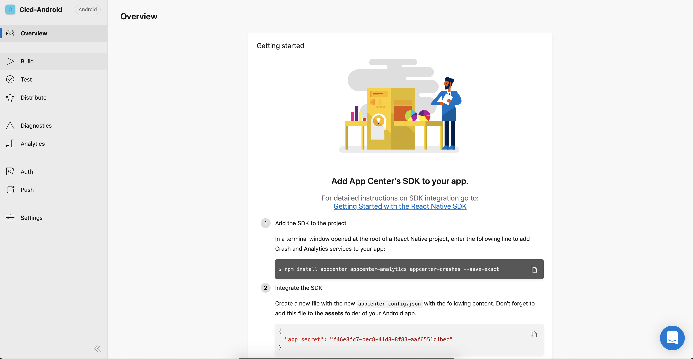

# AppCenter

## MSAppCenter

- Truy cập [appcenter.ms](https://appcenter.ms). Đăng kí tài khoản và đăng nhập

- Sau khi đăng kí, đăng nhập, Chọn Add New App

## Tạo App mới ( IOS ):

- Nhập tên App
- Chọn 1 trong 2 OS (**IOS hoặc Android**)
- Tiếp tục chọn **React Native** ở **Platform**
  

## **Lưu ý**

> Mỗi lần tạo mới app chỉ dùng được cho một hệ điều hành
>
> Tạo mới 2 app riêng biệt để có thể dùng cho cả Android và IOS

- Sau khi tạo app xog, sẽ có được key ở trang overview

- key này được dùng để tích họp vào project ở bước cài đặt với [React-Native](./ReactNative.md)
