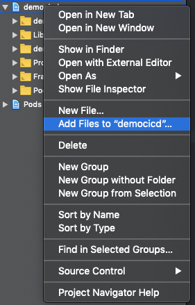
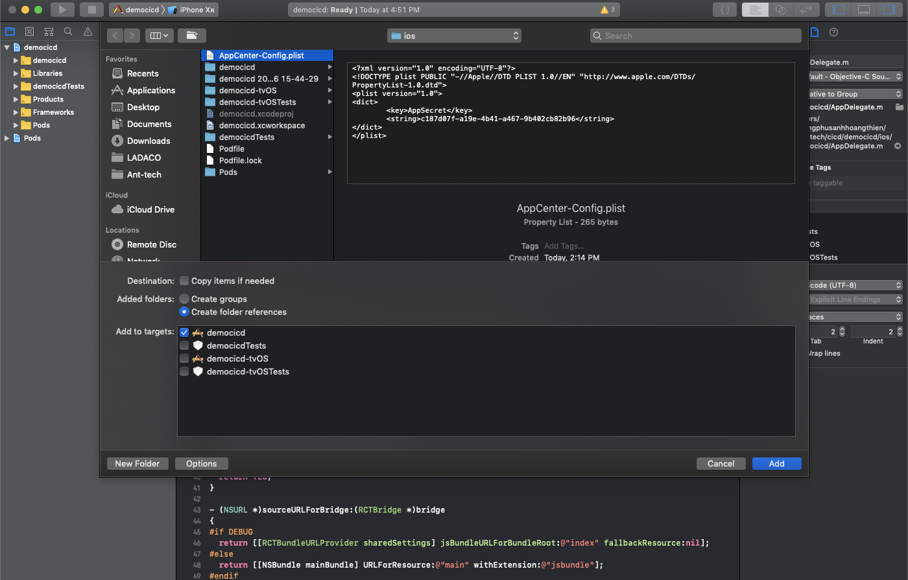
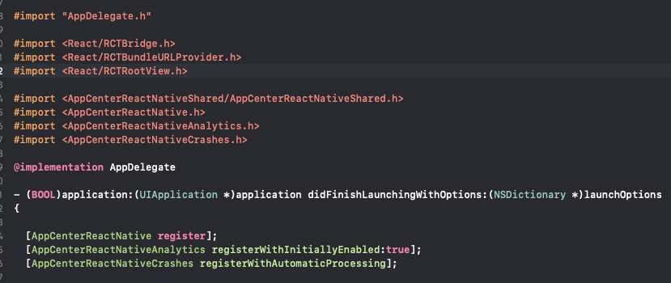

# Cài đặt với React Native 0.60

> **Lưu ý** : **APP_SECRET_VALUE** là đoạn mã được tạo ra ở bước [cài đặt app center](../Appcenter.md)

<details>
    <summary>
        IOS
    </summary>

- Tại thư mục ios :

  ```python
  pod install
  ```

- Tạo file `AppCenter-Config.plist` trong thư mục ios với nội dung :

  ```
  <?xml version="1.0" encoding="UTF-8"?>
  <!DOCTYPE plist PUBLIC "-//Apple//DTD PLIST 1.0//EN" "https://www.apple.com/DTDs/PropertyList-1.0.dtd">
  <dict version="1.0">
      <dict>
      <key>AppSecret</key>
      <string>{APP_SECRET_VALUE}</string>
      </dict>
  </dict>
  ```

- Thêm file `AppCenter-Config.plist` vừa tạo vào project
  - Mở file .xcworkspace bằng xcode
  - Chuột phải vào tên project chọn **Add Files to {tênproject}**



- Tìm đến file `AppCenter-Config.plist` vừa tạo



- Cấu hình file `AppDelegate.m` để có thể sử dụng

  - import :
    ```
    #import <AppCenterReactNativeShared/AppCenterReactNativeShared.h>
    #import <AppCenterReactNative.h>
    #import <AppCenterReactNativeAnalytics.h>
    #import <AppCenterReactNativeCrashes.h>`
    ```
  - sử dụng :

    ```
        [AppCenterReactNative register];
        [AppCenterReactNativeAnalytics registerWithInitiallyEnabled:true];
        [AppCenterReactNativeCrashes registerWithAutomaticProcessing];
    ```

  - Kết quả :
    

</details>

<details>
    <summary>
        Android
    </summary>

- Tạo file `appcenter-config.json` trong đường dẫn `android/app/src/main/assets/` với nội dung :

  ```
  {
    "app_secret": "{APP_SECRET_VALUE}"
  }
  ```

- Thêm vào file `strings.xml` trong đường dẫn `res/values/strings.xml` :
  ```
  <string name="appCenterCrashes_whenToSendCrashes" moduleConfig="true" translatable="false">ASK_JAVASCRIPT</string>
  <string name="appCenterAnalytics_whenToEnableAnalytics" moduleConfig="true" translatable="false">ALWAYS_SEND</string>
  ```
  </details>
