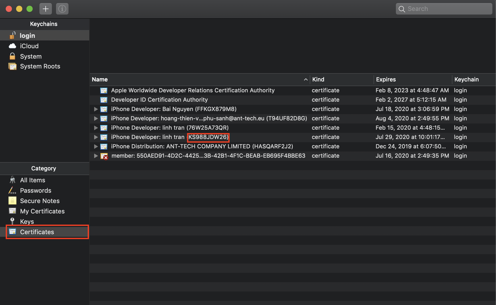
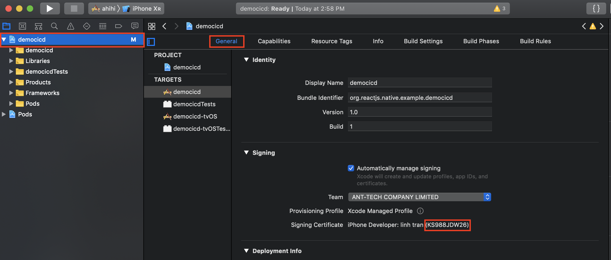

# Certificate

- Mở keychain và tìm đến `Certificate` trong mục `category`

**Lưu ý:**

> Chọn đúng certificate có trùng key của project

> Chọn certificate có trùng key trong xcode trong keychain
> 

> Tại xcode chọn **tên project** -> **General** để xem key
> 

- Khi có được Certificate và [Provision]('./iosConfigProvisioning.md)
  thì có thể mở sign builds và kéo thả cả 2 vào

