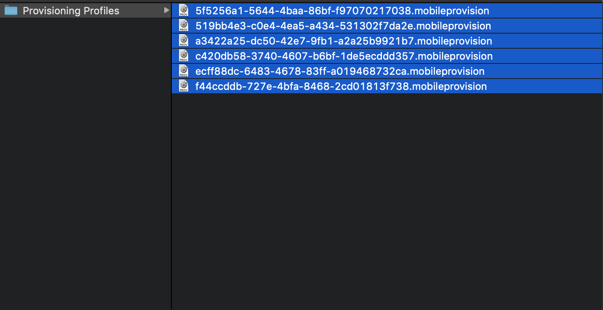
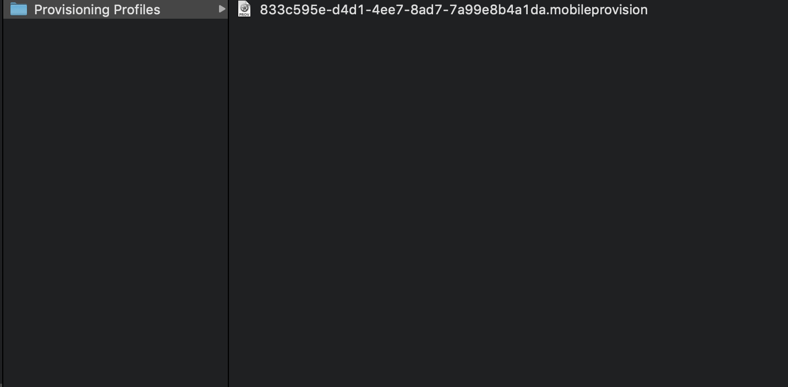
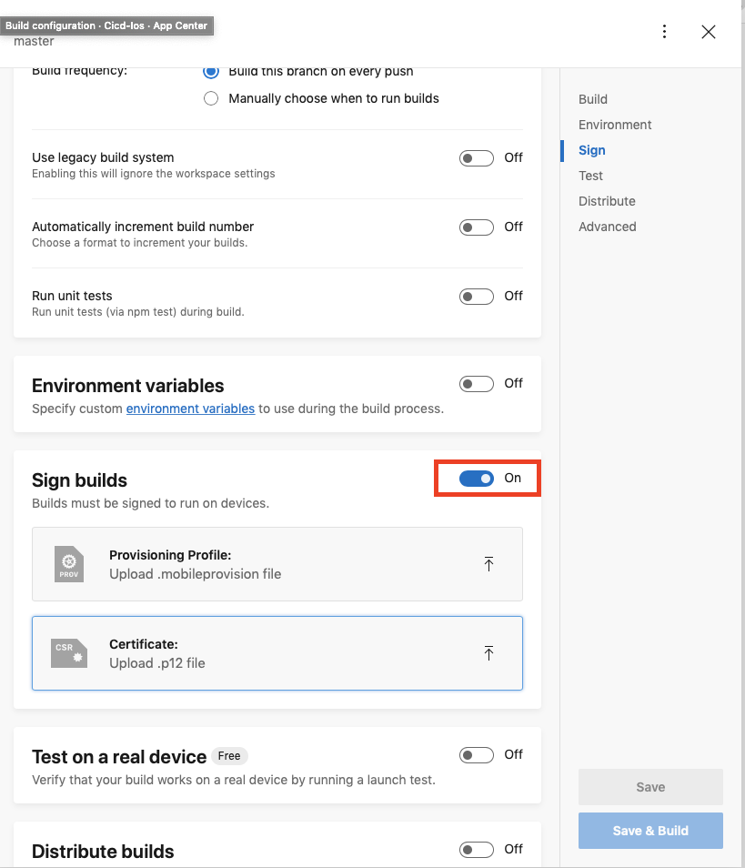

# Provisioning

- Mở **terminal** nhập :

```
open ~/Library/MobileDevice/"Provisioning Profiles"
```

- Cửa sổ finder sẽ hiện ra với nhiều provition

  > 
  > Nếu không thể xác định được provision cần thiết có thể xoá hết đi và chọn build lại
  >
  > Sau khi build sẽ có được provision mới nhất
  > 

- Khi có được Provision và [Certificate](./iosConfigCertificate.md)
  thì có thể mở sign builds và kéo thả cả 2 vào


