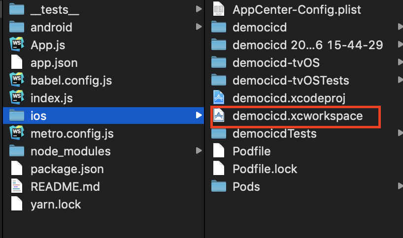
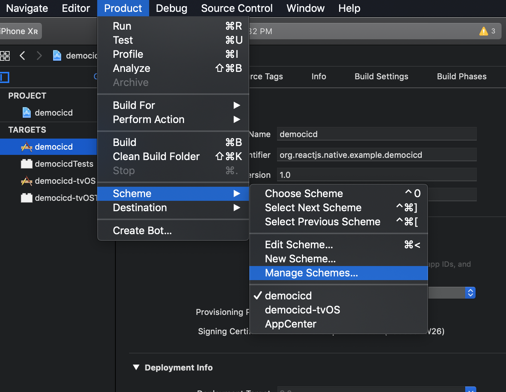
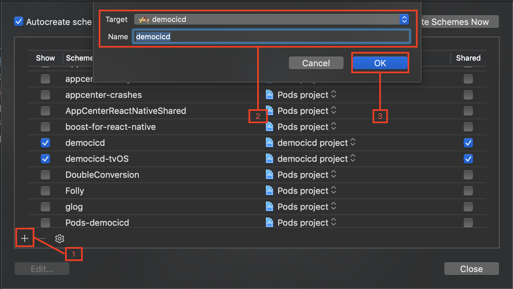
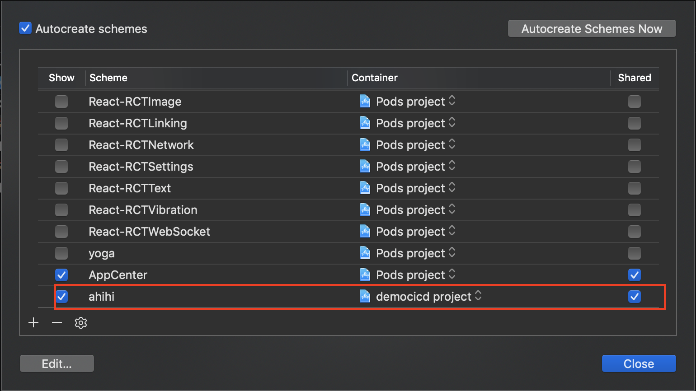
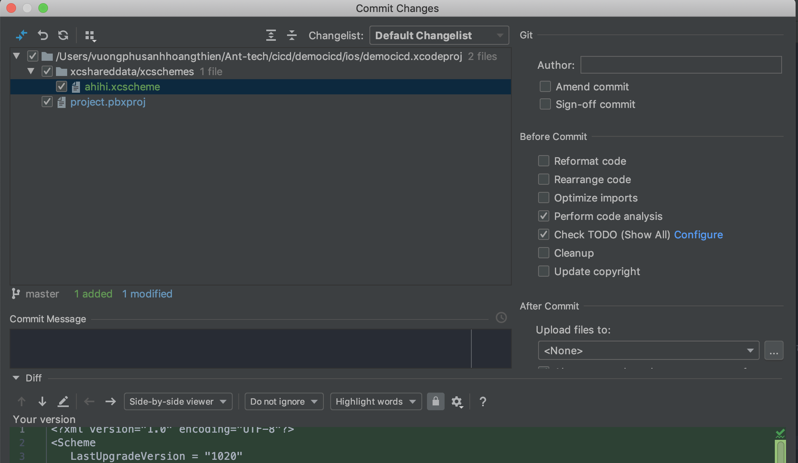
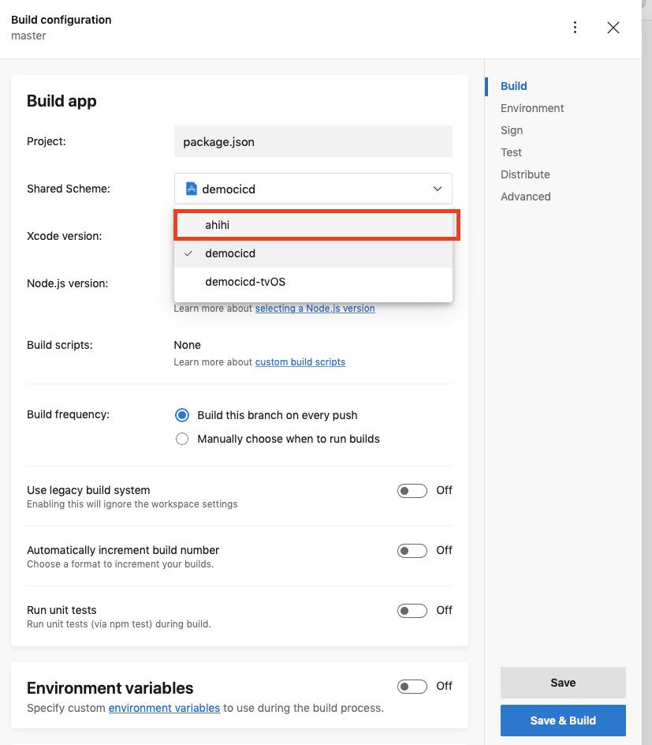

# _Xcode Build Schema_

1. Tạo build schema

- Mở file `.xcworkspace` trong thư mục `ios/`

  

- Tại toolbar trên Xcode chọn **_Product_** -> **_scheme_** -> **_manage schemes_**.

  

- Cấu hình cho scheme

  

  > _**(1)** tạo scheme_
  >
  > _**(2)** chọn target và name cho scheme_
  >
  > _**(3)** ok để tạo mới_

- Tìm scheme trong manage scheme và **chắc chắn đã tick vào shared**

  

**Lưu ý :**

> chắc chắn đã thêm scheme vào git

- Sau khi push xong, vào lại [appcenter.ms](https://appcenter.ms)
- Chọn đến app và kiểm tra trong build configuration để chọn scheme vừa tạo

